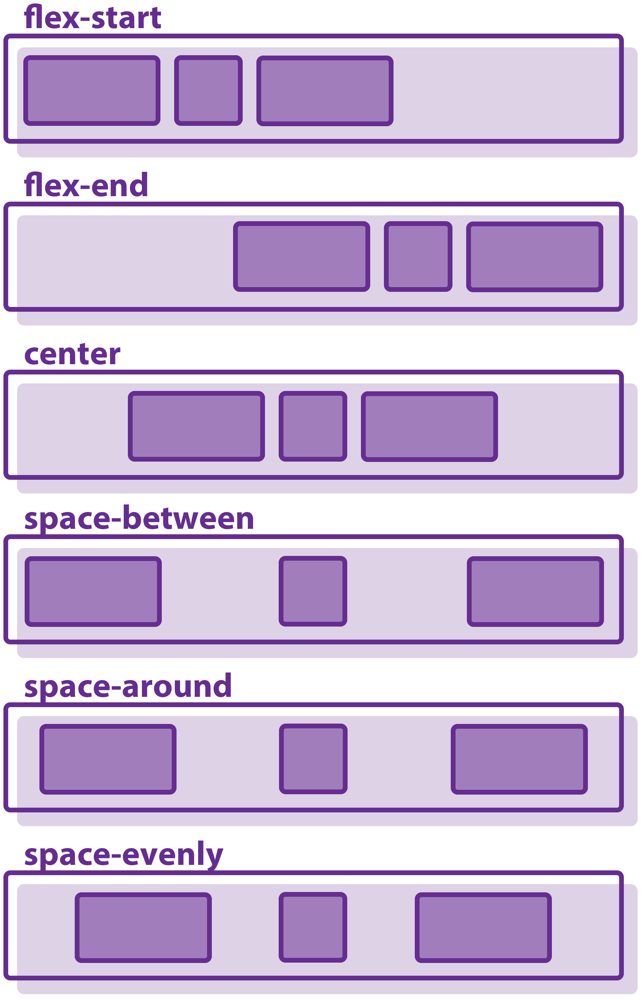

# **FlexBox**
El Módulo de Caja Flexible, comúnmente llamado flexbox, fue diseñado como un modelo unidimensional de layout, como un método que pueda ayudar a distribuir el espacio entre los ítems de una interfaz y mejorar las capacidades de alineación.
>[Concepto](https://developer.mozilla.org/es/docs/Web/CSS/CSS_Flexible_Box_Layout/Basic_Concepts_of_Flexbox)

#### **Propiedades del padre**
Propiedad | Valor | Función
:--:|:--:|:--:
display||Declarar un contenedor como flex.
||flex|De bloque, ocupara todo el ancho del padre.
||inline-flex|De línea, el ancho lo define el contenido.
flex-direction||Establecer el eje principal.
||row|Izquierda a derecha.
||row-reverse|Derecha a izquierda.
||colum|De arriba a abajo.
||column-reverse|De abajo a arriba.
flex-wrap||Evitar o permitir desbordamiento (cambio de línea).
||no-wrap|No permite desbordamiento. Todos los hijos en una sola línea.
||wrap|Si permite desbordamiento. Puede haber cambio de línea.
||wrap-reverse|Si permite desbordamiento. Pero en orden inverso.
flex-flow||Abreviación de flex-direction y flex-wrap.
||row nowrap|Valor por defecto.
justify-content||Alineacion en el eje principal.
||flex-start|Desde al inicio flex-direction.
||flex-end|Desde al final flex-direction.
||center|Centrará las cajas.
||space-between|Existirá una unidad de espacio a cada lado de las cajas.
||space-evenly|Espacio entre cajas y con los bordes del contenedor será igual.
align-items||Acomoda los hijos en el eje transversal (perpendicular al principal).
||stretch|Llenará el contenedor padre (default).
||flex-start|Al inicio del eje transversal.
||flex-end|Al final del eje transversal.
||center|Los centrará en el eje trasnversal.
||baseline|Se refiere a la línea en la que se sientan las fuentes.

#### **Propiedades del hijo**
Propiedad | Valor | Función
:--:|:--:|:--:
order||Controla el orden en que se desplegarán los hijos.
||0-n|El default es cero, el orden será el declarado en html.
flex-grow||Establece la habilidad del hijo para crecer.
||1-n|Por default todos son un 1, n será un valor de proporción.
flex-shrink||Establece la habilidad del hijo para encogerse.
||1-n|Por default todos son 1, n será un valor de proporción.
flex-basis||Tamaño default para un elemento antes de que el espacio restante sea distribuido. Puede ser en porcentaje.
||auto|Deacuerdo a las propiedades width y height.
||content|Deacuerdo al contenido.
flex||Abreviación para flex-grow, flex-shrink y flex-basis.

#### **Ejemplos**



#### **Ejemplos de código**
Flexbox simple.
```html
/*HTML*/
<!DOCTYPE html>
<html lang="en">
<head>
    <meta charset="UTF-8">
    <meta http-equiv="X-UA-Compatible" content="IE=edge">
    <meta name="viewport" content="width=device-width, initial-scale=1.0">
    <title>FlexBox</title>
    <link rel="stylesheet" href="css/FlexBox.css">
</head>
<body>
    <div class="contendorflex">
        <div class="cajaflex"><h2>Caja 1</h2></div>
        <div class="cajaflex"><h2>Caja 2</h2></div>
        <div class="cajaflex"><h2>Caja 3</h2></div>
        <div class="cajaflex"><h2>Caja 4</h2></div>
        <div class="cajaflex"><h2>Caja 5</h2></div>
        <div class="cajaflex"><h2>Caja 6</h2></div>
        <div class="cajaflex"><h2>Caja 7</h2></div>
        <div class="cajaflex"><h2>Caja 8</h2></div>
    </div>
</body>
</html>
```
```css
/*CSS*/
*{
     box-sizing: border-box;
     margin: 0;
     padding: 0;
 }

 h2{
    font-family: cursive;
 }

 .contendorflex {
     display: flex;
     flex-direction: column;
     flex-wrap: wrap;
     justify-content: center;
     align-items: center;
     background-color: black;
     text-align: center;
     width: 100vw;
     height: 100vh;
 }

 .cajaflex {
     background-color: blueviolet;
     width: 100px;
     height: 100px;
     margin: 10px;
 }
```
>[Códigos](https://github.com/David081015/castillo.git)